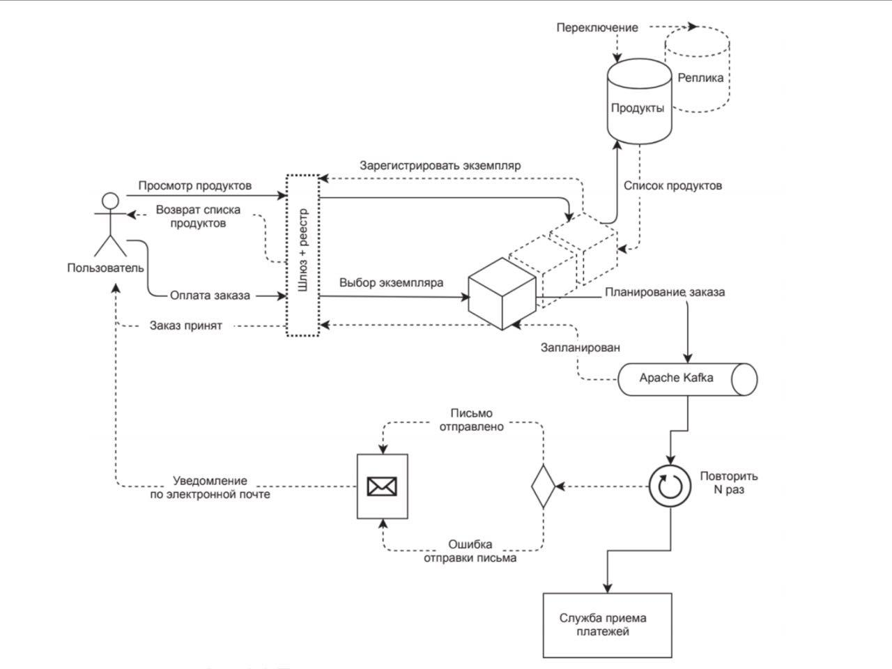
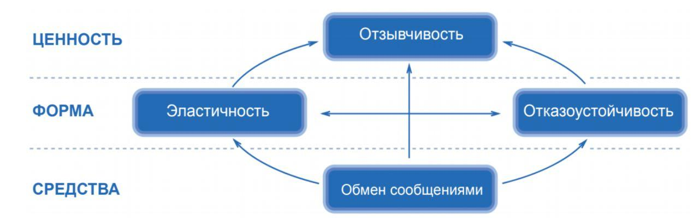

# Bank-Services

Below you will find some information on how to perform common tasks. 

## Table of Contents

- [Description](#description)
- [Stack](#stack)
- [Build](#build)

## Description

#####manifest of a reactive system

## Stack

* `Microservices`  References :
 [Martin Fowler](https://martinfowler.com/articles/microservices.html) - for building applications as suites of services. As well as the fact that services are independently deployable and scalable
 [Spring Cloud Netflix](https://cloud.spring.io/spring-cloud-netflix/reference/html/)  [ [1](https://medium.com/swlh/spring-cloud-service-discovery-with-eureka-16f32068e5c7) ] - for Service Discovery (Eureka), Circuit Breaker (Hystrix), [Intelligent Routing](https://microservices.io/patterns/apigateway.html) (Zuul)  and Client Side Load Balancing (Ribbon).
 [Client-side service discovery](https://microservices.io/patterns/client-side-discovery.html) - pattern

* `Reactor`  References : 
  [Reactive](https://spring.io/reactive) [ [1](http://reactivex.io/) ] - for low-latency, high-throughput workloads

* `Messaging`  References : 
  [Chris Richardson](https://microservices.io/patterns/communication-style/messaging.html) - for communicate

* `Spring`: 
  AOP
  MVC
  Data
  Security

* `Tools`: 
  Docker compose
  Bash

* `Server`:
  Reactive Netty 

## Build

### How to build
`./mvnw clean install`

### How to run
`./mvnw spring-boot:run`

